# The Dex
_Aims to be the best pokédex ever made._

## Features
0. Global
    - FR / EN 99% of the time
    - Dark theme (light in construction)
1. Pokédex
    - Pokemon list sorted by # and by generation
    - Search feature (includes SV's DLC)
2. Pokémon
    - Stats with gauges, EV gain, + pro mode with EV/IV/Nature sliders for stat calculation
    - Type's strength & weaknesses
    - Height, weight, egg group, catch rate...
    - Abilities
        - Click to access Ability's data
    - Moveset per generation and per game
        - Search & sort
        - Click to access Move's data
    - Locations (raw, but they're there)
    - Evolutions with family, method...
    - Sprites per generation and per game
3. Moves
    - All moves available until each gen, sorted by type in a music album kind of way
    - List of all moves per type with power, accuracy, PPs
    - List of Pokemon learning that move
4. Abilities
    - All abilities available until each gen
    - List of Pokémon having that ability (normal or hidden)

## Use
https://dex.lkyuusei.fr

## Or install idk
### App
1. clone
2. npm i
3. npm run dev

### Database
1. have a mongodb running somewhere
2. put your info in /src/lib/server/database/mongoose.ts
3. go to localhost:[port]/admin
4. click all the buttons to load data

???. profit

## Screenshots
### Pokedex
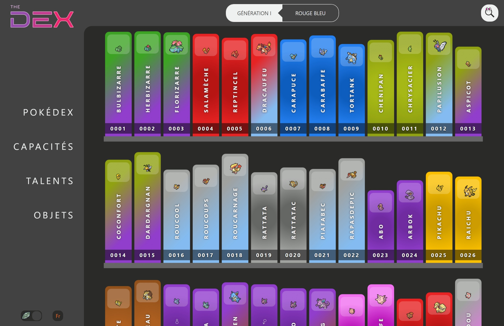
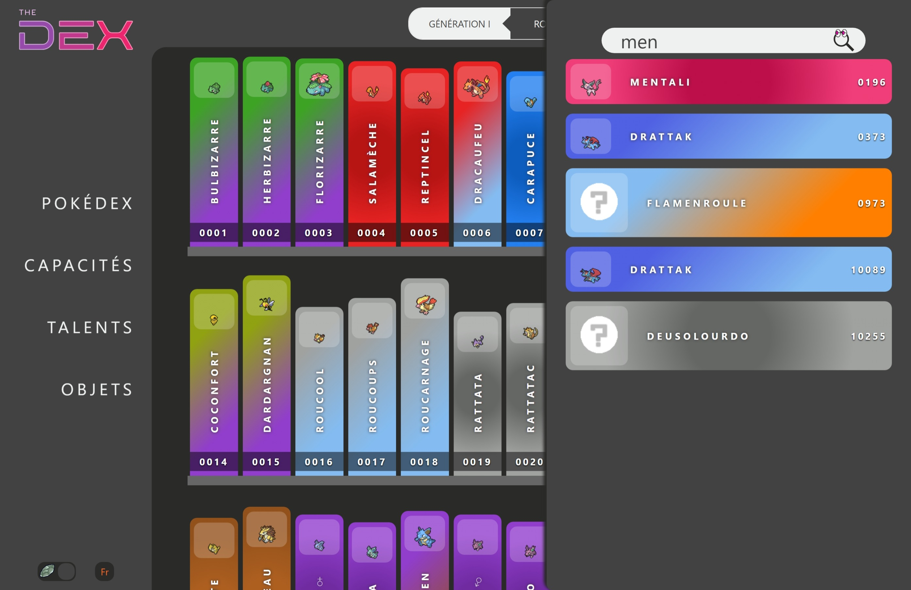

### Pokemon
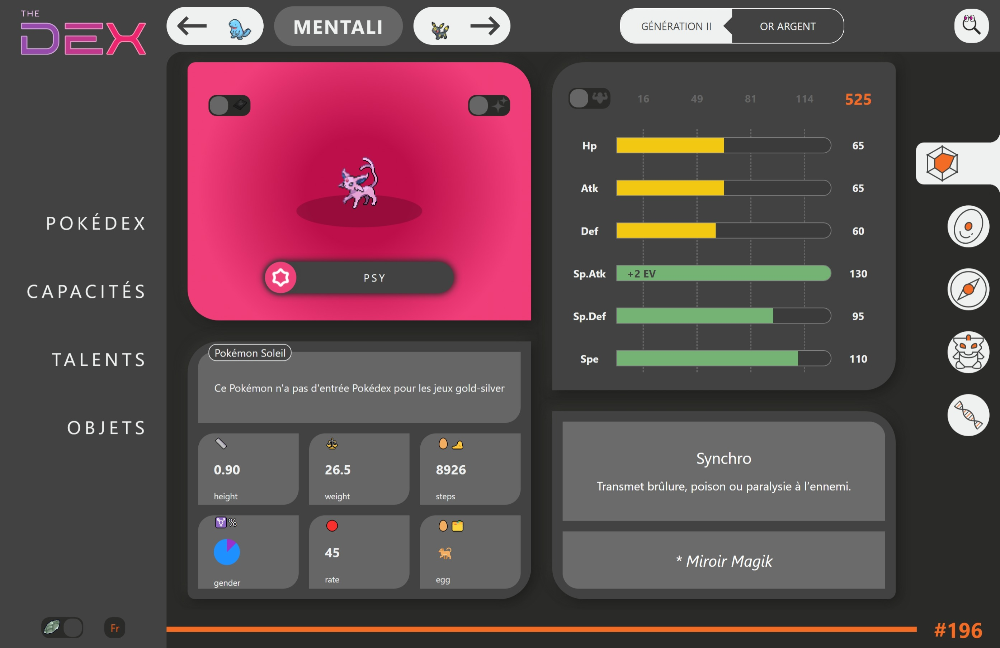
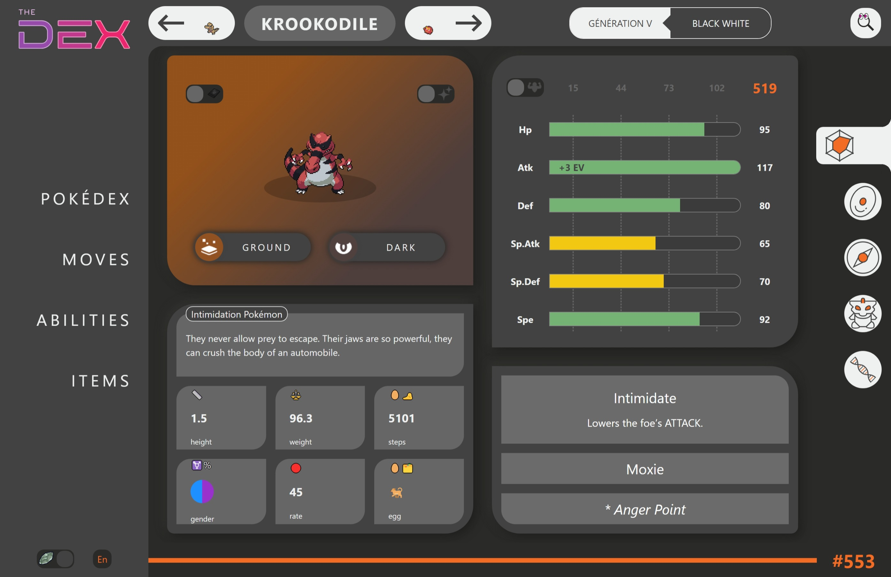
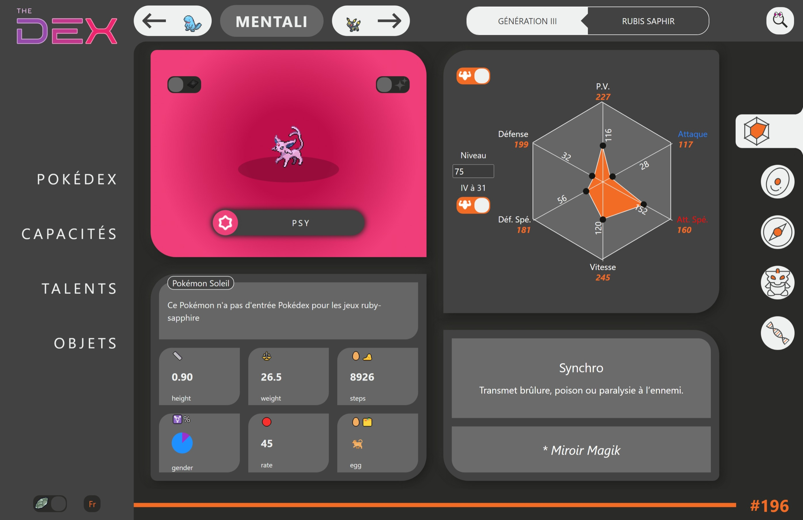
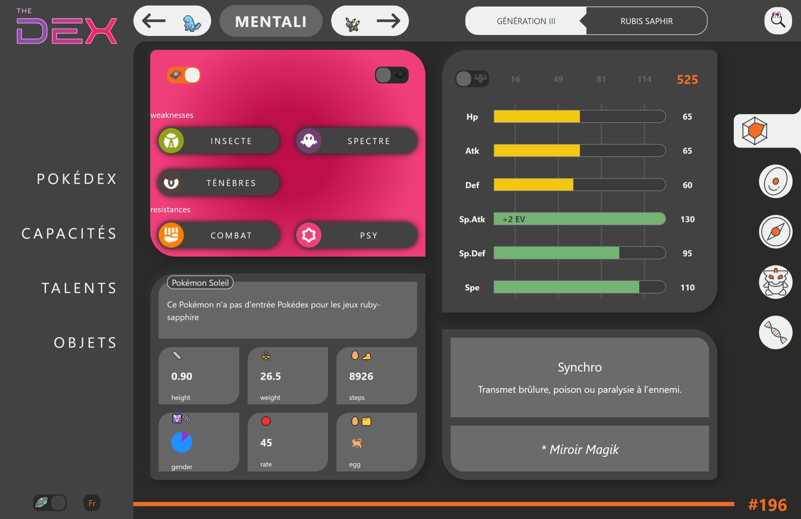
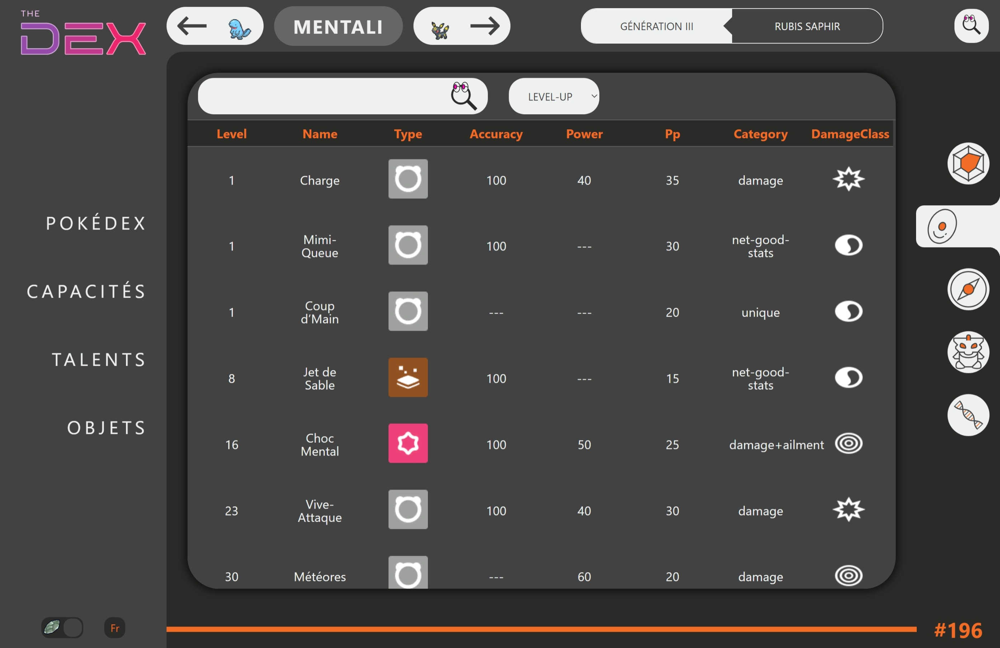
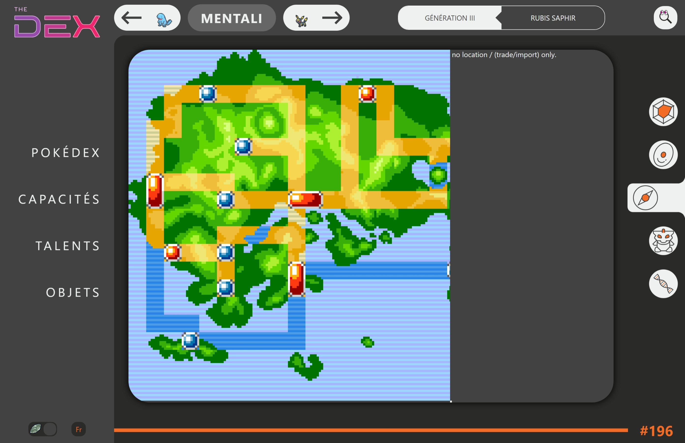
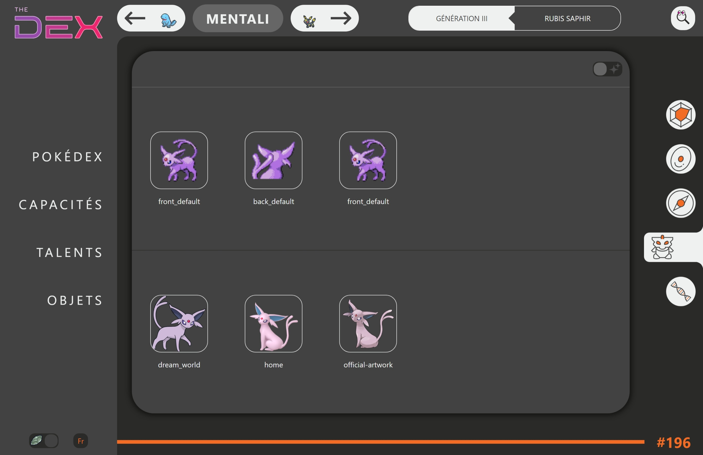
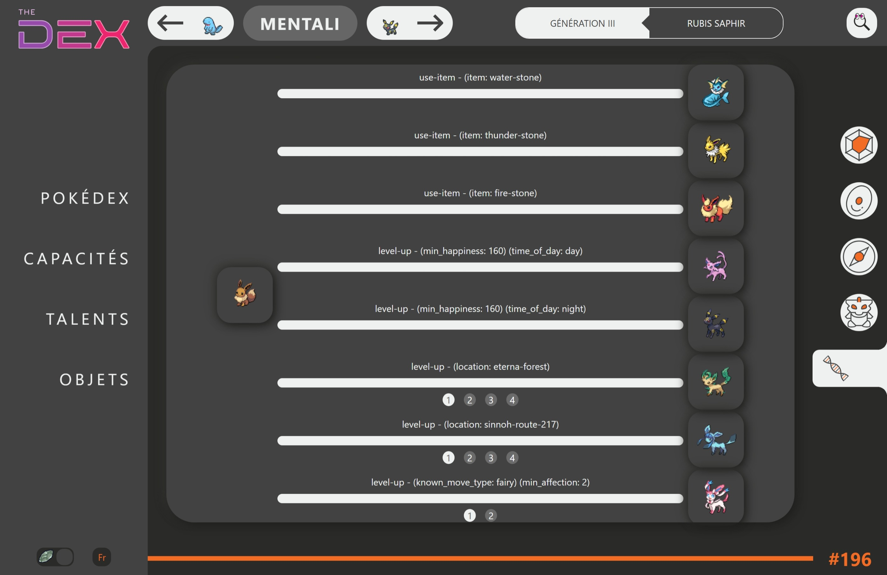

### Moves
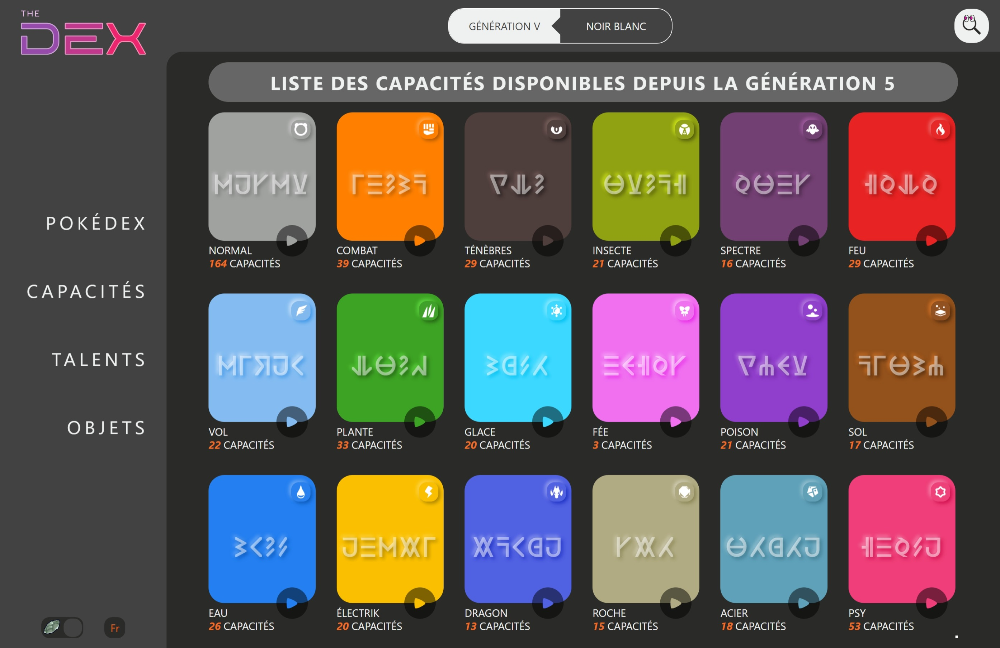
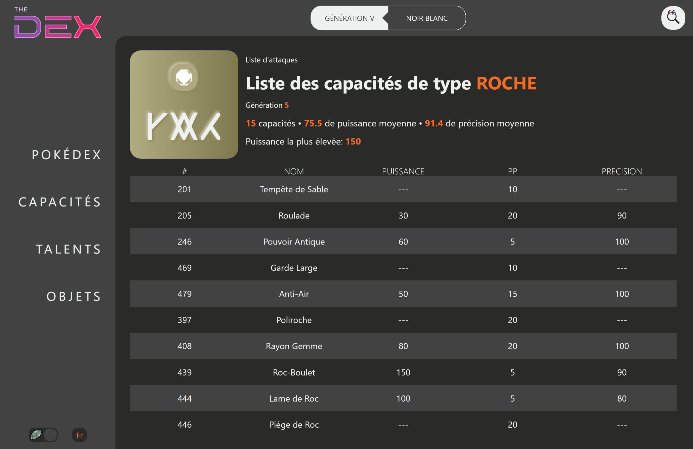
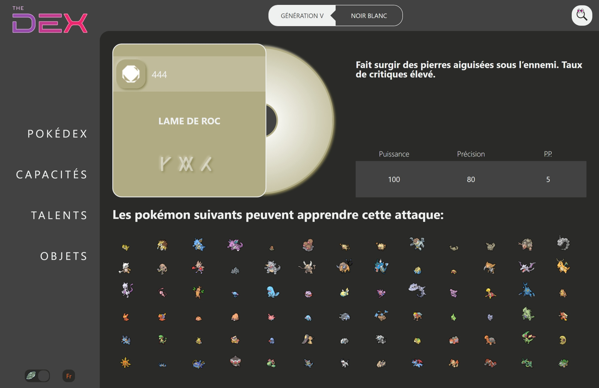

### Abilities

